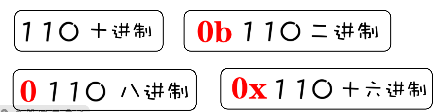

### 位运算:与(&)、或(|)、非(~)、异或(^)、左移(<<)、右移(>>)

位运算直接对整数在内存中的二进制位进行运算。常用位运算包括与、或、非、异或、左移、右移等。
1. 与(&)

> 1 & 1 == 1

> 1 & 0 == 0

> 0 & 0 == 0

将参与运算的两个操作数各自对应的二进制位进行“逻辑与”操作。只有对应的两个二进制位均为１时，对应二进制位的运算结果才为１，否则为０。

2. 或(|)

> 1 | 1 == 1

> 1 | 0 == 1

> 0 | 0 == 0

将参与运算的两个操作数各自对应的二进制位进行“逻辑或”操作。只有对应的两个二进制位均为0时，对应二进制位的运算结果才是0，否则为1。

3. 非(~)
单目运算符，它将操作数中的二进制位0变成1，把1变成0。

4. 异或(^)

> 1 ^ 1 == 0

> 1 ^ 0 == 1

> 0 ^ 0 == 0

　　将参与运算的两个操作数各自对应的二进制位进行“异或”操作。当对应的两个二进制位不相同时，对应二进制位的运算结果为1，当对应的两个二进制位相同时，运算结果为0。

5. 左移(<<)
> 0b1100 << 2 = 0b110000

　　左移运算是将左操作数的二进制形式全部向左移动若干位(右操作数的值)后得到的值。左移时，高位丢弃，右边低位补0。左移n位，就是乘以2"。

6. 右移(>>)
> 0b1100 >> 1 = 0b0110

　　右移运算的操作方式和左移运算类似，不同的是移动方向，移出最右边的位被丢弃。同样，右移n位相当于左操作数除以2"，并且将结果向下取整。对于无符号数，右移时高位总是补0。对于有符号数，在右移时，符号位(即最高位)一起移动。如果原符号位为1(代表负数)，则右移时右边高位都补1；如果原符号位为0(代表正数)，则右移时高位补0， 即保持原有的正负。


1.进制与进制转换：二进制、八进制、十进制、十六进制




> 十进制转二进制： 将给定的十进制数逐步除以2，并记录每一步的余数（0或1），直到商为0为止。然后将记录的余数从低位到高位排列，得到对应的二进制数。
例如，将十进制数27转换为二进制：
```
27 ÷ 2 = 13 余 1
13 ÷ 2 = 6  余 1
6  ÷ 2 = 3  余 0
3  ÷ 2 = 1  余 1
1  ÷ 2 = 0  余 1
```
将上述的余数从低位到高位排列得到：11011，所以27的二进制表示为11011。

> 二进制转十进制： 将给定的二进制数，从右到左依次乘以2的幂，幂的指数从0开始递增。最后将所有乘积相加即可得到对应的十进制数。
例如，将二进制数11011转换为十进制：

```
1 × 2^4 + 1 × 2^3 + 0 × 2^2 + 1 × 2^1 + 1 × 2^0 = 27
```
所以11011的十进制表示为27。

> 十进制转八进制： 将给定的十进制数逐步除以8，并记录每一步的余数（0~7），直到商为0为止。然后将记录的余数从低位到高位排列，得到对应的八进制数。
例如，将十进制数99转换为八进制：
```
99 ÷ 8 = 12 余 3
12 ÷ 8 = 1  余 4
1  ÷ 8 = 0  余 1
```
> 将上述的余数从低位到高位排列得到：143，所以99的八进制表示为143。

八进制转十进制： 将给定的八进制数，从右到左依次乘以8的幂，幂的指数从0开始递增。最后将所有乘积相加即可得到对应的十进制数。
例如，将八进制数143转换为十进制：
```
1 × 8^2 + 4 × 8^1 + 3 × 8^0 = 99
```
所以143的十进制表示为99。

> 十进制转十六进制： 将给定的十进制数逐步除以16，并记录每一步的余数（0~9、A~F），直到商为0为止。然后将记录的余数从低位到高位排列，得到对应的十六进制数。
例如，将十进制数255转换为十六进制：
```
255 ÷ 16 = 15 余 F
15  ÷ 16 = 0  余 F
```
将上述的余数从低位到高位排列得到：FF，所以255的十六进制表示为FF。

十六进制转十进制： 将给定的十六进制数，从右到左依次乘以16的幂，幂的指数从0开始递增。最后将所有乘积相加即可得到对应的十进制数。
例如，将十六进制数FF转换为十进制：
```
F × 16^1 + F × 16^0 = 255
```
所以FF的十进制表示为255。


