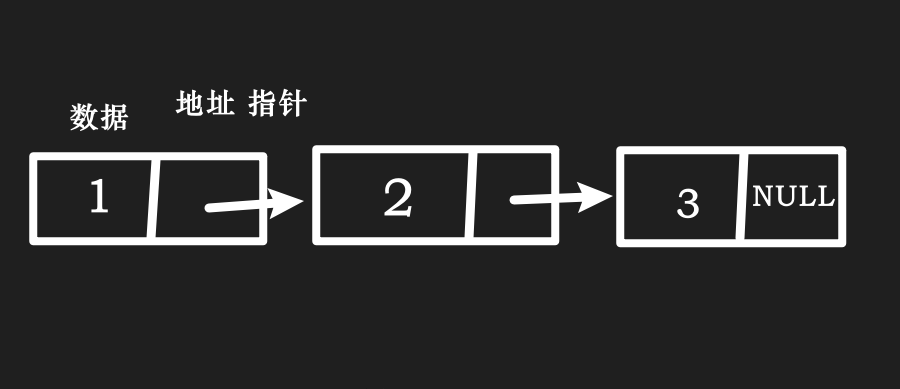
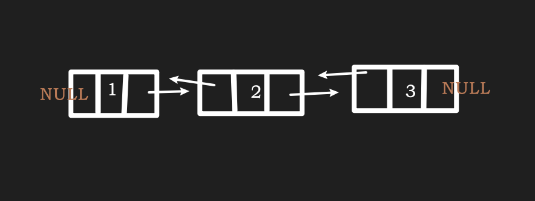
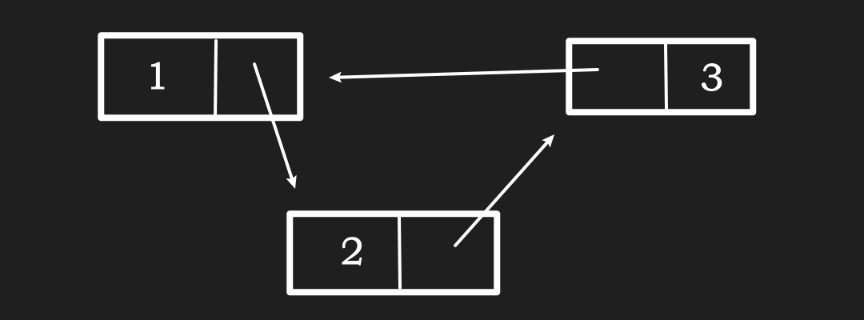
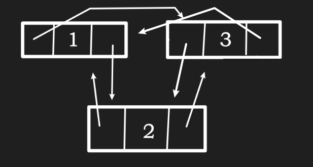

2.1 数据结构
2.1.1 线性结构
2.1.1.1 链表：单链表、双向链表、循环链表

    链表是一种在物理存储空间上不连续的存储结构，链表内元素的逻辑顺序是通过链表中的指针链接次序实现的。根据链表的指针链接方式，链表一般分为

- 单链表
- 双向链表
- 循环链表
1. 单链表
单链表也称为单向链表，其结点中包含数据域data 与指针域next，数据域用来存储数据，指针域用来链接下一个结点.

单链表一般有查找、插入、删除等操作，其中插入操作有头插法、尾插法两种方法。

2. 双向链表
    双向链表结点中包含数据域 data 与两个指针域prev和next， prev指向当前元素的前驱元素， next 指向当前元素的后继元素，如果某个元素没有前驱元素，则该元素是链表的第一个元素，也就是头指针(head)，如果某个元素没有后继元素，则该元素是链表的最后一个元素，也就是尾指针(tail)。

3.循环链表

    循环链表分为单向循环链表和双向循环链表。
如果将单向链表中最后一个元素的指针指向第一个元素，则这样的单向链表就是单向循环链表。
如果将双向链表中第一个元素的前驱指针指向双向链表的最后一个元素，再将双向链表中最后一个元素的后继指针指向双向链表的第一个元素，那么这样的双向链表就是双向循环链表。
循环链表一般有查找、插入、删除等操作。

- 简单循环链表

- 双向循环链表：

