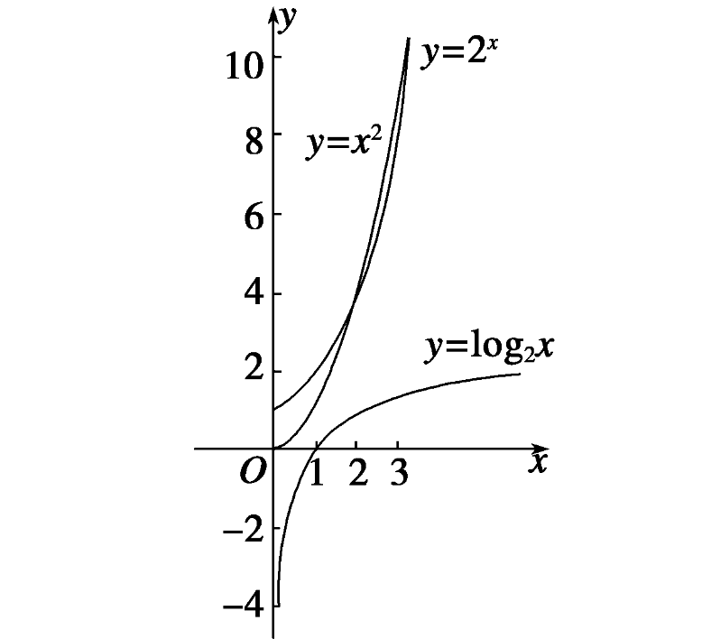

### 时间复杂度和空间复杂度基本常识

#### 时间复杂度
    时间复杂度：时间复杂度是指算法执行所需的时间量度。它表示随着输入规模的增加，算法的执行时间如何增长。

1. 常数时间复杂度（O(1)）：无论输入规模大小，执行时间都保持恒定。
2. 线性时间复杂度（O(n)）：执行时间正比于输入规模。
3. 对数时间复杂度（O(log n)）：执行时间随着输入规模的增加而稍微增长，但增长速度很慢。
4. 平方时间复杂度（O(n^2)）：执行时间随着输入规模的增加而显著增长。
5. 指数时间复杂度（O(2^n)）：执行时间呈指数级增长，通常是最低效的情况。


> 时间复杂度描述了算法的执行时间与输入规模之间的关系，帮助我们预估算法的运行效率。

<br>

#### 空间复杂度
    空间复杂度是指算法执行所需的存储空间量度。它表示随着输入规模的增加，算法所使用的额外空间如何增长。

1. 常数空间复杂度（O(1)）：算法使用的额外空间是固定的，与输入规模无关。
2. 线性空间复杂度（O(n)）：算法使用的额外空间随着输入规模线性增长。
3. 对数空间复杂度（O(log n)）：算法使用的额外空间随着输入规模的增加而稍微增长，但增长速度很慢。
4. 平方空间复杂度（O(n^2)）：算法使用的额外空间随着输入规模的增加而显著增长。
5. 指数空间复杂度（O(2^n)）：算法使用的额外空间呈指数级增长，通常是最低效的情况。

> 空间复杂度描述了算法在执行过程中所需的存储空间与输入规模之间的关系，帮助我们评估算法对内存的使用情况。

需要注意的是，时间复杂度和空间复杂度并不总是同时存在，某些算法可能在时间上效率高但空间占用大，或者反之。因此，在设计和分析算法时，我们通常需要综合考虑两者来评估算法的效率和性能。



常用算法时间复杂度:

- (O(1)):

```c++
#include <iostream>
using namespace std;


void printFirstElement(int arr[], int size) {
    if (size > 0) {
        cout << "First element: " << arr[0] << endl;
    }
}

int main() {
    int arr[] = {1, 2, 3, 4, 5};
    int size = sizeof(arr) / sizeof(arr[0]);

    printFirstElement(arr, size);
    
    return 0;
}

```


- (O(n)):

```c++
#include <iostream>
using namespace std;

void printElements(int arr[], int size) {
    for (int i = 0; i < size; i++) {
        cout << arr[i] << " ";
    }
    cout << endl;
}

int main() {
    int arr[] = {1, 2, 3, 4, 5};
    int size = sizeof(arr) / sizeof(arr[0]);

    printElements(arr, size);
    
    return 0;
}

```
- (O(log n)):

```c++
#include <iostream>
using namespace std;

int binarySearch(int arr[], int left, int right, int target) {
    //log2(8) = 3，意味着 2 的 3 次幂等于 8。
    while (left <= right) {
        int mid = left + (right - left) / 2;
        //假设数组的长度为 n，每次迭代都将待查找区域缩小为原来的一半，那么最多需要 log2(n) 次迭代才能找到目标值，其中 log2 表示以 2 为底的对数。
        if (arr[mid] == target)
            return mid;
        else if (arr[mid] < target)
            left = mid + 1;
        else
            right = mid - 1;
    }
    cout << "函数退出 没有找到你想要找的元素" << endl;
    return -1;
}

int main() {
    int arr[] = {1, 2, 3, 4, 5};
    int size = sizeof(arr) / sizeof(arr[0]);
    int target = 3;

    int result = binarySearch(arr, 0, size - 1, target);
    if (result != -1)
        cout << "Element found at index " << result << endl;
    else
        cout << "Element not found" << endl;

    return 0;
}

```

- (O(n^2)):

```c++
#include <iostream>
using namespace std;
 
void printPairs(int arr[], int size) 
{
    for (int i = 0; i < size; i++)
	{
        for (int j = i + 1; j < size; j++)//内层循环的迭代次数是 size - i - 1
		{//并不是内层一定要循环size次 时间复杂度只和最高次有关 
            cout << "(" << arr[i] << ", " << arr[j] << ") ";
        }
    }
    cout << endl;
}

int main() {
    int arr[] = {1, 2, 3, 4, 5};
    int size = sizeof(arr) / sizeof(arr[0]);

    printPairs(arr, size);
    
    return 0;
}

```


- (O(2^n)):

```c++
#include <iostream>
using namespace std;
 
int fibonacci(int n)
{
    if(n == 1 || n == 2)// 1 1 2 3 5 8
    {
    	return 1;
    }
    return fibonacci(n-1) + fibonacci(n-2);
}

int main() {
    int n = 6;
    cout << "Fibonacci number at position " << n << ": " << fibonacci(n) << endl;

    return 0;
}

```


